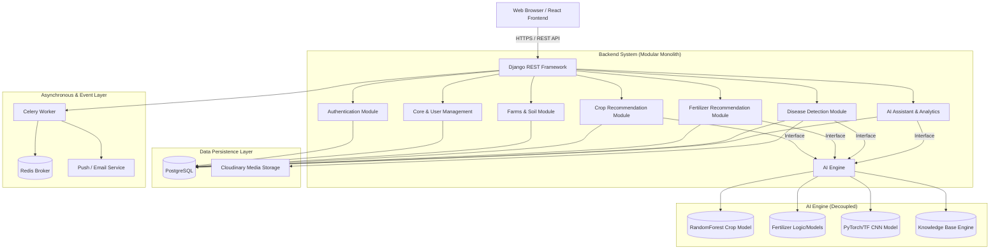
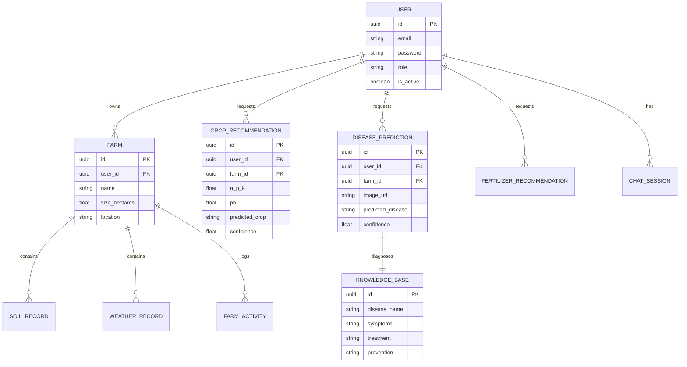
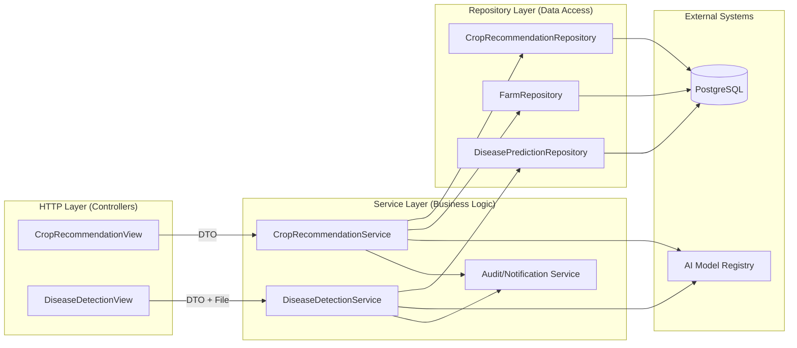
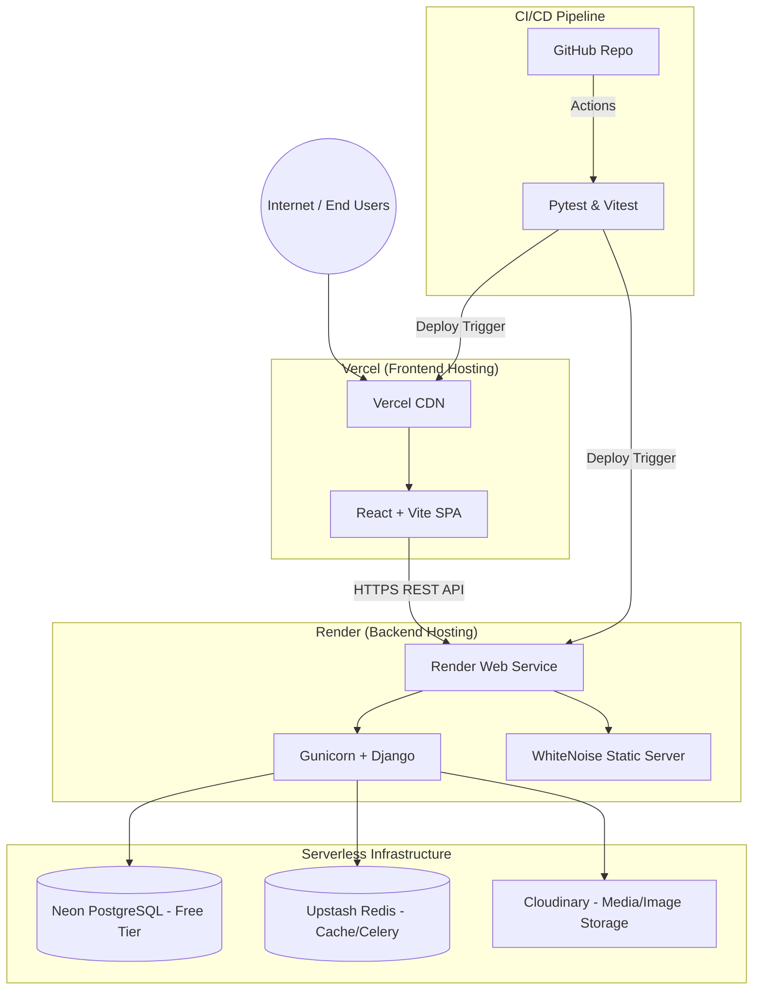

# Dhatree AI System Architecture Diagrams

This document contains visual representations of the Dhatree AI v1.0.0 architecture. These diagrams are generated using Mermaid.js and represent the strict Modular Monolith patterns and Free-Tier cloud infrastructure.

## 1. High-Level System Architecture

## 2. Database Entity-Relationship (ER) Diagram

## 3. System Component Diagram (Service Layer Pattern)

## 4. Free-Tier Deployment Architecture

