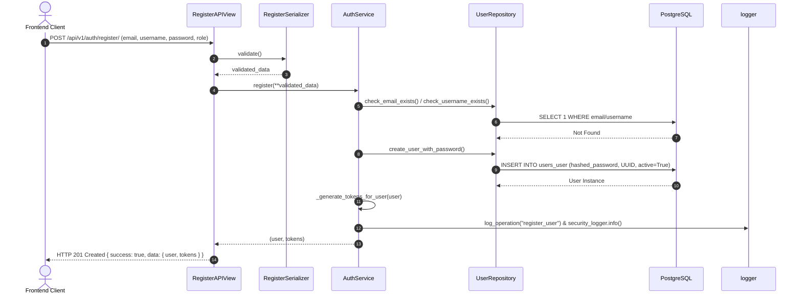
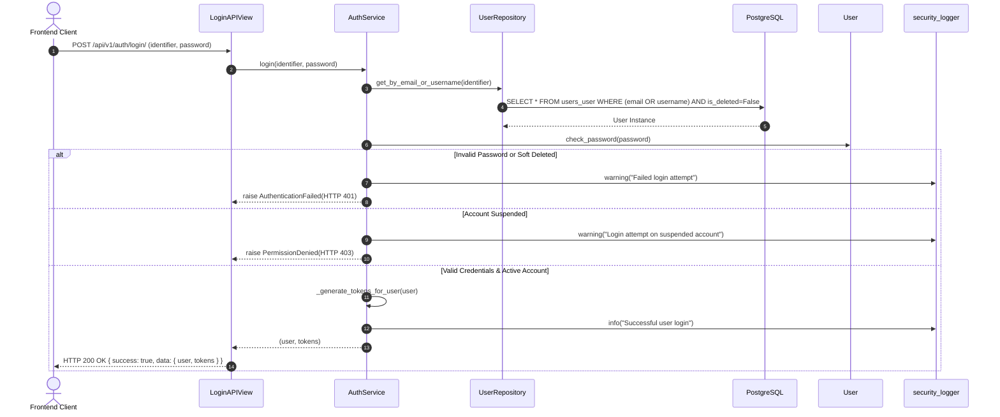
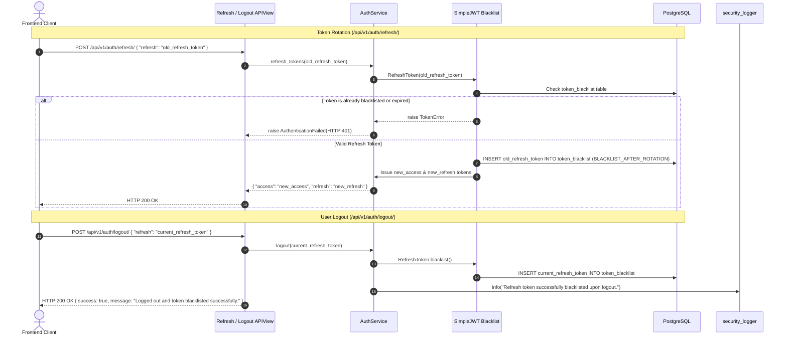

# DHATREE AI - AUTHENTICATION & SECURITY FLOW SPECIFICATION

Dhatree AI implements a secure, stateless authentication and authorization architecture built on **JSON Web Tokens (JWT)** via `djangorestframework-simplejwt` with mandatory refresh token rotation, token blacklisting, and Role-Based Access Control (RBAC).

---

## 1. JWT Configuration & Token Lifecycle

Tokens are generated and validated according to strict security lifecycles configured in `backend/config/settings/base.py`:
- **Access Token Lifetime**: 60 minutes (`timedelta(minutes=60)`).
- **Refresh Token Lifetime**: 7 days (`timedelta(days=7)`).
- **Token Rotation (`ROTATE_REFRESH_TOKENS: True`)**: Every time `/api/v1/auth/refresh/` is called with a valid refresh token, a new access token AND a new refresh token are issued.
- **Blacklisting (`BLACKLIST_AFTER_ROTATION: True`)**: The previous refresh token is immediately blacklisted in PostgreSQL (`token_blacklist` table) upon rotation or explicit logout. Any subsequent attempt to use a blacklisted token is rejected with `HTTP 401 Unauthorized`.

### Custom JWT Claims
Every issued access and refresh token embeds critical user identity attributes directly into its payload to prevent unnecessary database lookups on authenticated read endpoints:
```json
{
  "token_type": "access",
  "exp": 1721060000,
  "iat": 1721056400,
  "jti": "8f9a2b1c-3d4e-5f6a-7b8c-9d0e1f2a3b4c",
  "user_id": "b5b590e2-3183-4070-8539-a7d45f7b27ea",
  "email": "farmer.ramesh@dhatree.ai",
  "username": "farmer_ramesh",
  "role": "farmer"
}
```

---

## 2. Authentication Sequence Diagrams

### 2.1 User Registration Flow (`POST /api/v1/auth/register/`)



### 2.2 User Login Flow (`POST /api/v1/auth/login/`)



### 2.3 Token Rotation & Logout Blacklisting (`POST /api/v1/auth/refresh/` & `/logout/`)



---

## 3. Account Lifecycle & Security Guards

Every authentication operation checks the user's account status (`account_status` and `is_deleted` flags):

| Account Status / Flag | Login (`/login/`) Behavior | API Request Behavior (`IsAuthenticated`) |
| :--- | :--- | :--- |
| `is_active: True`, `account_status: 'active'` | **200 OK** + JWT Tokens Issued | **200 OK** (Allows API access based on RBAC) |
| `account_status: 'suspended'` | **403 Forbidden** (`PermissionDenied`) | **403 Forbidden** (Custom JWT middleware / verification checks) |
| `is_deleted: True` (Soft Deleted) | **401 Unauthorized** (Account not found in active pool) | **401 Unauthorized** |
| `is_active: False` | **401 Unauthorized** (`AuthenticationFailed`) | **401 Unauthorized** |

---

## 4. Role-Based Access Control (RBAC) Matrix

Dhatree AI enforces strict permission boundaries across roles (`User.Role`):

| Role | Permitted Actions | Restricted Actions |
| :--- | :--- | :--- |
| `admin` (`IsAdmin`) | List all users (`GET /api/v1/users/`), soft-delete any account (`DELETE /api/v1/users/{id}/`), global read/write across all modules. | Cannot hard-delete audit logs or bypass database constraints. |
| `farmer` (`IsFarmer`) | Register, update own profile (`PUT /api/v1/auth/profile/`), manage own farms, crops, and disease scans (`OwnerOnly`). | **403 Forbidden** when attempting to list users or access other farmers' farms. |
| `agronomist` (`IsAgronomist`) | Review disease scans assigned to their territory, publish advisory notes, manage recommendation rules. | **403 Forbidden** when attempting administrative user deletions. |
| `researcher` (`IsResearcher`) | Read-only access (`AdminOrReadOnly`) to anonymized disease scan aggregations and model inference logs. | **403 Forbidden** on farmer profile modifications or farm mutations. |
